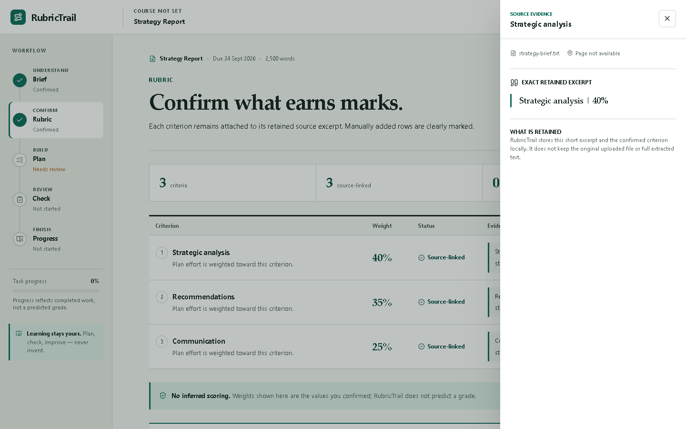
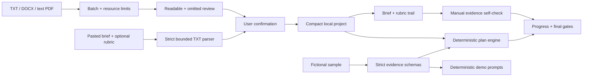

# RubricTrail

**Turn the brief into a plan you can prove.**

RubricTrail is a local-first assignment planner that connects an uploaded or
pasted brief and rubric to confirmed requirements, scheduled work, draft
evidence and final human checks.

It is designed for students who need more than a document summary. Every
criterion can retain a short source excerpt recorded during intake, and every plan
task has a definition of done. RubricTrail does not write a submission, invent a
criterion, or predict a grade.

> Project status: early-stage open-source project. There are no public
> usage or adoption claims yet. The complete local workflow and fictional sample
> are runnable without an account, API key or paid service.



The production screenshot above and the mobile viewport are reviewed in
[the visual QA report](./docs/VISUAL_QA_REPORT.md).

## What works today

### Use your own assignment

1. Upload up to 10 TXT, DOCX or text-based PDF files (10 MiB each, 25 MiB
   combined), or paste the brief and optional rubric from a course page, email
   or scan. A PDF can contain up to 200 pages, with 400 PDF pages allowed across
   the complete selection. Every selected PDF whose page-count metadata can be
   read contributes to that 400-page total, even if the PDF is later explicitly
   omitted because it exceeds the 200-page per-file limit.
2. If one file has a recoverable per-file problem, explicitly choose whether to
   continue with the readable files, replace the complete selection or paste all
   text instead. This includes a PDF that exceeds its 200-page file limit.
3. Review fields found in the included sources and fill anything missing.
4. Confirm the rubric names and whether the official rubric provides a complete
   percentage breakdown. Complete weighting requires every criterion to have a
   published percentage and the total to equal 100%.
5. If the breakdown is incomplete, keep any official percentages and leave
   unknown values blank. RubricTrail stores those criteria as `number | null`
   and uses the same neutral planning baseline for every criterion; this is not
   a claim that they earn equal marks.
6. Create a compact project saved only in the current browser.
7. Work through **Brief → Rubric → Plan → Check → Progress**.

The custom workflow includes:

- deterministic browser-local file extraction and plain-text paste intake;
- bounded parsing with file-count, per-file and combined byte limits, PDF page
  limits, and merged extracted-text limits of 2,000,000 normalized characters,
  50,000 merged lines and 100,000 merged whitespace-delimited words;
- explicit mixed-batch recovery that requires a decision before omitting a file
  with a recoverable per-file problem;
- retained rubric excerpts with recorded filename and PDF page when available;
- strict UTF-8 decoding for TXT files, with malformed text rejected instead of
  silently inserting replacement characters;
- a generic dependency-aware plan linked only to confirmed criteria;
- `focused`, `standard`, `thorough` and `extended` planning-depth choices that
  adjust task scope and time allowance only; they do not correspond to or
  predict a grade;
- explicit `complete`, `incomplete` and `none` weighting states that never
  estimate missing percentages; only a complete 100% breakdown weights the
  plan, while the other states use a neutral planning baseline;
- capacity warnings based on deadline and weekly study time;
- task completion that respects prerequisites;
- criterion-by-criterion self-checks for visible, explained and traceable
  evidence;
- a final human submission checklist;
- a revisioned authoritative browser record containing the v3 state payload,
  with validated migration from v2 and the earlier sample-state format;
- deep local-state validation, recovery messaging and visible storage failures;
- exclusive Web Locks coordination so concurrent current-version writes from the
  same observed revision cannot both win;
- compatibility-key fingerprints that surface a parseable older-tab change as
  a recovery candidate instead of silently selecting it, plus a verified privacy
  purge when the user explicitly resets the project;
- versioned project backups that can be restored without retaining original files.

Original files and full uploaded or pasted source text are not written to
`localStorage`. Pasted intake is limited to 100,000 characters and 10,000 lines
before it enters the same bounded TXT parser. Confirmed fields, weighting status,
rubric percentages or `null`, short source excerpts, pasted self-check text and
progress are stored until the user resets the project. Names and error details
for files omitted from a partial batch stay only in the current intake flow and
are not added to the saved project or backup. Selection-wide PDF-page and merged
text limits stop the complete batch; they do not omit later files according to
selection order. The PDF-page total includes every selected PDF with readable
page-count metadata, including a per-file over-limit PDF offered for omission.
Saved evidence must include a canonical source id and a filename from the
project source list; the same source id cannot claim different filenames, and
excerpt offsets must match the retained text. Because full source text is
discarded, a restored excerpt remains a recorded aid rather than independently
verified proof—compare the original before relying on it.

### Back up or restore a project

Use **Project backup → Download backup** in the workspace to save a
`*.rubrictrail.json` file. The welcome screen can restore that file on the same
or another device. RubricTrail previews the project name, export time and
replacement scope before restoring it, validates both file and project versions,
and writes the imported state before changing the open workspace.
State-v3 backups remain separate from the outer backup-format version. Valid v2
uploaded custom projects and backups migrate to v3 with their complete numeric
weights preserved; sample and empty state migrate without an uploaded rubric.
For backward compatibility, state v3 still stores the planning-depth choice in
its existing numeric `targetGrade` field. Those legacy numbers are an internal
plan-profile encoding only; they are not a requested, estimated or predicted
mark. The four values previously exposed by the interface keep the same task
gates and time multipliers, so this wording correction does not silently
reschedule an existing supported profile.
Newer unsupported versions still fail with an upgrade message rather than being
guessed at. Browser persistence now uses the authoritative
`rubrictrail.project.store.v1` record, whose format is separate from the state-v3
and backup protocols. Each successful mutation takes the exclusive
`rubrictrail.project.store.v1` Web Lock, compares the complete observed baseline,
then writes the next monotonic revision as either an active project or a cleared
tombstone. Two writes, or a write and clear, starting from the same revision
therefore serialize and only the first can succeed; the other reports a conflict.

The older `rubrictrail.project.v3`, `rubrictrail.project.v2` and
`proofline.project.v1` values are retained during normal saves and migration.
The authoritative record fingerprints their exact bytes. If one parseable
legacy value later changes, RubricTrail can present it as an older-tab recovery
candidate without making that value authoritative automatically. An explicit
project reset instead writes a content-free guard, removes all three compatibility
values, verifies the deletion and keeps only a content-free cleared tombstone.
This coordination is an application protocol over Web Storage, not a claim that
`localStorage` itself provides transactions or atomic compare-and-swap.

If Web Locks are unavailable or lock acquisition fails, RubricTrail fails closed:
it can still read the saved project, but it does not write or reset browser state.
New edits remain only in that tab, and the interface asks the user to keep one tab
open and download a backup before closing. Autosave waits 250 ms; hidden-page and
`pagehide` handlers make an additional best-effort flush attempt, but an immediate
close or force-kill can still lose the final uncommitted edit.

A backup contains the compact saved project: course details, source labels or
original filenames, short source excerpts, pasted draft or self-check text, task
progress and final checks. It does **not** contain the original uploaded
documents or the full uploaded/pasted intake text, and it is not encrypted. Keep
the downloaded file private.
Derived sample Draft Check results are intentionally omitted and must be rerun
after restore; user-authored draft text remains in the backup.

### Explore the fictional sample

The included LumaLane operations assignment demonstrates deeper source mapping
and deterministic coaching. Its Draft Check uses simple surface signals and is
explicitly labelled as neither semantic evaluation nor a predicted grade.
The sample workspace includes a direct **Use my assignment** handoff back to real
file or pasted-text intake.

All files in [`samples/`](./samples/) are original fictional material:

- `lumalane-assignment-brief.txt`
- `lumalane-rubric.txt`
- `lumalane-student-draft.txt`

## Product principles

- **Traceable:** a criterion or requirement should point back to source text.
- **Actionable:** rubric language should become work, dependencies and a clear
  definition of done.
- **Local-first:** the useful default should not need an account, cloud service
  or API key.
- **Integrity-aware:** prompts support student judgment and authorship; they do
  not replace either.
- **Honest states:** navigation, task completion, self-checks and readiness are
  separate signals.

## Quick start

Requirements:

- Node.js 24 or newer
- pnpm 11

```bash
git clone https://github.com/Sion612/rubrictrail.git
cd rubrictrail
pnpm install --frozen-lockfile
pnpm dev
```

Open <http://localhost:3000>. No `.env` file is required.

## Verification

Run the non-browser gate:

```bash
pnpm check
```

It runs ESLint, TypeScript, Vitest and a production build. Then run the desktop
and narrow responsive browser suite:

```bash
pnpm test:e2e --workers=1
```

Local browser runs use the development server for faster iteration. The CI
browser job creates a separate production build and sets
`PLAYWRIGHT_PRODUCTION=true`, causing Playwright to exercise that artifact
through `next start`.

Current v0.4.1 release-candidate runtime and test-code verification on 12 August 2026
([commit `de147fd`, GitHub Actions run 31587275622](https://github.com/Sion612/rubrictrail/actions/runs/31587275622)):

| Gate | Result |
| --- | --- |
| ESLint | Passed with zero warnings |
| TypeScript | Passed |
| Vitest | 257/257 tests passed across 19 files |
| Next.js production build | Passed independently in the quality and browser jobs |
| Playwright | GitHub Actions: 28/28 executions passed through `next start` (14 scenarios × 1440×900 and 390×844 Chromium projects), including the configured HTTP security headers, suppressed `X-Powered-By`, disabled Live routes, strict UTF-8 rejection, recorded-evidence trust copy, lock-serialized same-revision writes, confirmed self-check persistence, multi-tab and cross-version recovery, complete/partial/unweighted rubrics, and targeted 320×700 checks |
| Full dependency audit | No known vulnerabilities found |

Playwright covers the sample loop, complete and mixed real-file projects,
explicit omitted-file review, pasted brief and rubric intake, manual repair of a
missing rubric without fabricated weights, partial published weights, local
persistence and privacy, recorded-evidence drawer focus, malformed UTF-8 and
recoverable unsupported files, empty drafts, multi-tab overwrite protection,
explicit v2-to-v3 recovery, console errors and horizontal overflow. The narrow projects test responsive
Chromium viewports; they are not mobile-device, touch or mobile-UA emulation.
The HTTP contract checks are production-runtime smoke tests, not a deployment,
penetration test or claim of complete security-header coverage.

## Architecture



Core modules:

| Area | Main files |
| --- | --- |
| App orchestration | `src/components/rubrictrail-app.tsx` |
| Local file parsing | `src/lib/files/parse-assignment-files.ts` |
| Uploaded project model and plan templates | `src/lib/uploaded-project.ts` |
| Dependency-aware scheduling | `src/lib/plan.ts` |
| Versioned browser state | `src/lib/local-state.ts` |
| Strict sample and optional Live schemas | `src/lib/domain.ts`, `src/lib/ai/*` |
| Desktop/responsive acceptance tests | `tests/e2e/core-flow.spec.ts` |

See [the architecture notes](./docs/ARCHITECTURE.md) for data and trust
boundaries.

## Privacy and security

- No analytics or telemetry are included.
- Local mode makes no OpenAI request.
- PDF scripting and evaluation are disabled.
- `.env*` files are ignored except for `.env.example`.
- Dependency updates are monitored by Dependabot.
- Default responses disable framing, MIME sniffing and unused camera,
  microphone and geolocation access.
- CI runs lint, type, unit, build, browser and full dependency-audit gates.

Experimental Live API adapters exist for future self-hosting, but the UI exposes
no Live control. Routes are disabled by default and require a separate bearer
token before a bounded request body is read. Do not run a public Live service
without per-user authentication, rate limits, budget caps, abuse monitoring and
an explicit preview/consent flow.

Read [SECURITY.md](./SECURITY.md) before deployment.

## Known limitations

- Scanned and encrypted PDFs are not parsed directly; there is no OCR, but users
  can paste the readable brief and rubric text instead.
- Local byte, PDF-page and merged-text limits reduce resource risk but are not a
  CPU or peak-memory sandbox. PDF metadata, one page's text items, or DOCX
  decompression may consume resources before a limit can be applied. Parsing is
  currently not cancellable; do not open deliberately malicious documents.
- Custom projects rely on user confirmation rather than semantic AI extraction.
- Planning depth changes the generated task scope and time allowance, not the
  meaning of the rubric or the likelihood of a grade.
- The self-check records the user's judgment; it does not validate argument
  quality or source correctness.
- There is no account, automatic sync, collaboration or multi-project dashboard;
  moving data requires an explicit local backup and restore. Detected external
  changes pause autosave, but simultaneous edits are not automatically merged
  even though current-version mutations are serialized with an exclusive Web
  Lock. Without Web Locks, changes remain tab-only and require a manual backup.
- Close-time saving is best effort: the final debounced edit may be lost if the
  page or browser is terminated before its asynchronous save completes.
- Local-first describes where assignment content is processed and persisted; it
  is not a promise that the site can be loaded or reopened completely offline.
- The interface and parser are English-first.
- RubricTrail is not a substitute for the actual rubric, university policy,
  tutor advice or final human review.

More detail is in [docs/KNOWN_LIMITATIONS.md](./docs/KNOWN_LIMITATIONS.md).

## Roadmap

- cancellable worker-based document parsing with stronger pre-extraction
  resource controls;
- stronger table extraction for real-world rubrics;
- more date and grading-system formats;
- accessibility review with external users;
- contributor-authored course templates;
- opt-in, self-hosted Live support only after consent, cost and abuse controls.

## Contributing

Issues and pull requests are welcome. Start with
[CONTRIBUTING.md](./CONTRIBUTING.md), follow the
[code of conduct](./CODE_OF_CONDUCT.md), and never attach real student work to a
public issue.

The project is maintained by [Sion612](https://github.com/Sion612). See
[MAINTAINERS.md](./MAINTAINERS.md).

## License

Licensed under [Apache-2.0](./LICENSE). See [NOTICE](./NOTICE) for the original
fictional sample attribution.
