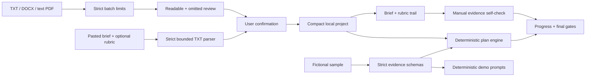

# RubricTrail

**Turn the brief into a plan you can prove.**

RubricTrail is a local-first assignment planner that connects an uploaded or
pasted brief and rubric to confirmed requirements, scheduled work, draft
evidence and final human checks.

It is designed for students who need more than a document summary. Every
criterion can retain the exact source excerpt that supports it, and every plan
task has a definition of done. RubricTrail does not write a submission, invent a
criterion, or predict a grade.

> Project status: early-stage open-source project. There are no public
> usage or adoption claims yet. The complete local workflow and fictional sample
> are runnable without an account, API key or paid service.


The production screenshot above and the mobile viewport are reviewed in
[the visual QA report](./docs/VISUAL_QA_REPORT.md).

## What works today

### Use your own assignment

1. Upload up to 10 TXT, DOCX or text-based PDF files (10 MB each, 25 MB combined),
   or paste the brief and optional rubric from a course page, email or scan.
2. If one file cannot be read, explicitly choose whether to continue with the
   readable files, replace the complete selection or paste all text instead.
3. Review fields found in the included sources and fill anything missing.
4. Confirm the rubric names and whether the official rubric provides a complete
   percentage breakdown. Complete weighting requires every criterion to have a
   published percentage and the total to equal 100%.
5. If the breakdown is incomplete, keep any official percentages and leave
   unknown values blank. RubricTrail stores those criteria as `number | null`
   and uses the same neutral planning baseline for every criterion; this is not
   a claim that they earn equal marks.
6. Create a compact project saved only in the current browser.
7. Work through **Brief → Rubric → Plan → Check → Progress**.

The custom workflow includes:

- deterministic browser-local file extraction and plain-text paste intake;
- bounded parsing with file-count, combined-size and extracted-text limits;
- explicit mixed-batch recovery that never silently drops an unreadable file;
- exact retained rubric excerpts with filename and PDF page when available;
- a generic dependency-aware plan linked only to confirmed criteria;
- explicit `complete`, `incomplete` and `none` weighting states that never
  estimate missing percentages; only a complete 100% breakdown weights the
  plan, while the other states use a neutral planning baseline;
- capacity warnings based on deadline and weekly study time;
- task completion that respects prerequisites;
- criterion-by-criterion self-checks for visible, explained and traceable
  evidence;
- a final human submission checklist;
- v3 local persistence with validated migration from v2 and the earlier
  sample-state format;
- deep local-state validation, recovery messaging and visible storage failures;
- best-effort multi-tab conflict checks that pause autosave when v3 or retained
  v2 state diverges from this tab's observed lineage;
- versioned project backups that can be restored without retaining original files.

Original files and full uploaded or pasted source text are not written to
`localStorage`. Pasted intake is limited to 100,000 characters and 10,000 lines
before it enters the same bounded TXT parser. Confirmed fields, weighting status,
rubric percentages or `null`, short source excerpts, pasted self-check text and
progress are stored until the user resets the project. Names and error details
for files omitted from a partial batch stay
only in the current intake flow and are not added to the saved project or backup.

### Back up or restore a project

Use **Project backup → Download backup** in the workspace to save a
`*.rubrictrail.json` file. The welcome screen can restore that file on the same
or another device. RubricTrail previews the project name, export time and
replacement scope before restoring it, validates both file and project versions,
and writes the imported state before changing the open workspace.
State-v3 backups remain separate from the outer backup-format version. Valid v2
uploaded custom projects and backups migrate to v3 with their complete numeric
weights preserved; sample and empty state migrate without an uploaded rubric.
Newer unsupported versions still fail with an upgrade message rather than being
guessed at. The v2 browser value is retained as a recovery candidate. Each v3
save records a non-cryptographic fingerprint of the v2 bytes it superseded, so
a later divergent write by an older tab is surfaced as a cross-version conflict.

RubricTrail compares the observed v3 and v2 values before a write and reads both
back afterward. Detected divergence pauses autosave and asks which version to
keep. These checks are best effort: `localStorage` does not provide transactions
or atomic compare-and-swap, so a narrow write race can still occur between
separate operations. Download a backup before resolving edits that matter in
multiple tabs or versions.

A backup contains the compact saved project: course details, source labels or
original filenames, short source excerpts, pasted draft or self-check text, task
progress and final checks. It does **not** contain the original uploaded
documents or the full uploaded/pasted intake text, and it is not encrypted. Keep
the downloaded file private.
Derived sample Draft Check results are intentionally omitted and must be rerun
after restore; user-authored draft text remains in the backup.

### Explore the fictional sample

The included LumaLane operations assignment demonstrates deeper source mapping
and deterministic coaching. Its Draft Check uses simple surface signals and is
explicitly labelled as neither semantic evaluation nor a predicted grade.
The sample workspace includes a direct **Use my assignment** handoff back to real
file or pasted-text intake.

All files in [`samples/`](./samples/) are original fictional material:

- `lumalane-assignment-brief.txt`
- `lumalane-rubric.txt`
- `lumalane-student-draft.txt`

## Product principles

- **Traceable:** a criterion or requirement should point back to source text.
- **Actionable:** rubric language should become work, dependencies and a clear
  definition of done.
- **Local-first:** the useful default should not need an account, cloud service
  or API key.
- **Integrity-aware:** prompts support student judgment and authorship; they do
  not replace either.
- **Honest states:** navigation, task completion, self-checks and readiness are
  separate signals.

## Quick start

Requirements:

- Node.js 24 or newer
- pnpm 11

```bash
git clone https://github.com/Sion612/rubrictrail.git
cd rubrictrail
pnpm install --frozen-lockfile
pnpm dev
```

Open <http://localhost:3000>. No `.env` file is required.

## Verification

Run the non-browser gate:

```bash
pnpm check
```

It runs ESLint, TypeScript, Vitest and a production build. Then run the desktop
and mobile browser suite:

```bash
pnpm test:e2e --workers=1
```

Current v0.3.3 verification on 12 August 2026:

| Gate | Result |
| --- | --- |
| ESLint | Passed with zero warnings |
| TypeScript | Passed |
| Vitest | 125/125 tests passed across 14 files |
| Next.js production build | Passed |
| Playwright | GitHub Actions: 18/18 flows passed at 1440×900 and 390×844, including the two-tab overwrite regression and targeted 320×700 checks |
| Full dependency audit | No known vulnerabilities found |

Playwright covers the sample loop, complete and mixed real-file projects,
explicit omitted-file review, pasted brief and rubric intake, manual repair of a
missing rubric, local persistence and privacy, evidence drawer focus,
recoverable unsupported files, empty drafts, multi-tab overwrite protection,
console errors and horizontal overflow.

## Architecture



Core modules:

| Area | Main files |
| --- | --- |
| App orchestration | `src/components/rubrictrail-app.tsx` |
| Local file parsing | `src/lib/files/parse-assignment-files.ts` |
| Uploaded project model and plan templates | `src/lib/uploaded-project.ts` |
| Dependency-aware scheduling | `src/lib/plan.ts` |
| Versioned browser state | `src/lib/local-state.ts` |
| Strict sample and optional Live schemas | `src/lib/domain.ts`, `src/lib/ai/*` |
| Desktop/mobile acceptance tests | `tests/e2e/core-flow.spec.ts` |

See [the architecture notes](./docs/ARCHITECTURE.md) for data and trust
boundaries.

## Privacy and security

- No analytics or telemetry are included.
- Local mode makes no OpenAI request.
- PDF scripting and evaluation are disabled.
- `.env*` files are ignored except for `.env.example`.
- Dependency updates are monitored by Dependabot.
- Default responses disable framing, MIME sniffing and unused camera,
  microphone and geolocation access.
- CI runs lint, type, unit, build, browser and full dependency-audit gates.

Experimental Live API adapters exist for future self-hosting, but the UI exposes
no Live control. Routes are disabled by default and require a separate bearer
token before a bounded request body is read. Do not run a public Live service
without per-user authentication, rate limits, budget caps, abuse monitoring and
an explicit preview/consent flow.

Read [SECURITY.md](./SECURITY.md) before deployment.

## Known limitations

- Scanned and encrypted PDFs are not parsed directly; there is no OCR, but users
  can paste the readable brief and rubric text instead.
- Local byte and retained-text limits reduce accidental resource exhaustion but
  do not provide a complete CPU or peak-memory sandbox for malicious compressed
  DOCX/PDF files.
- Custom projects rely on user confirmation rather than semantic AI extraction.
- The self-check records the user's judgment; it does not validate argument
  quality or source correctness.
- There is no account, automatic sync, collaboration or multi-project dashboard;
  moving data requires an explicit local backup and restore. Detected external
  changes pause autosave, but simultaneous edits are not automatically merged
  and Web Storage cannot make the protection transactional.
- The interface and parser are English-first.
- RubricTrail is not a substitute for the actual rubric, university policy,
  tutor advice or final human review.

More detail is in [docs/KNOWN_LIMITATIONS.md](./docs/KNOWN_LIMITATIONS.md).

## Roadmap

- cancellable worker-based document parsing with stronger peak-resource limits;
- stronger table extraction for real-world rubrics;
- more date and grading-system formats;
- accessibility review with external users;
- contributor-authored course templates;
- opt-in, self-hosted Live support only after consent, cost and abuse controls.

## Contributing

Issues and pull requests are welcome. Start with
[CONTRIBUTING.md](./CONTRIBUTING.md), follow the
[code of conduct](./CODE_OF_CONDUCT.md), and never attach real student work to a
public issue.

The project is maintained by [Sion612](https://github.com/Sion612). See
[MAINTAINERS.md](./MAINTAINERS.md).

## License

Licensed under [Apache-2.0](./LICENSE). See [NOTICE](./NOTICE) for the original
fictional sample attribution.
