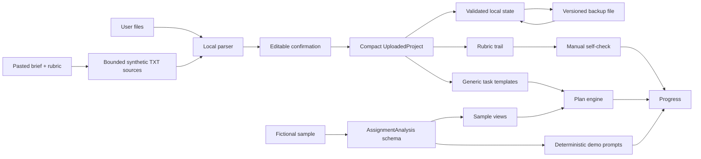

# RubricTrail technical architecture

RubricTrail is a local-first Next.js application with two deliberately separate
paths: a conservative user-source path and a rich fictional sample path.

## Runtime layers

| Layer | Responsibility | Main files |
| --- | --- | --- |
| Product shell | Project type, navigation, real step states, notices | `src/components/rubrictrail-app.tsx`, `workspace-shell.tsx` |
| Source intake | Browser-local TXT, DOCX and text-PDF parsing plus bounded pasted plain text | `src/lib/files/parse-assignment-files.ts`, `src/lib/pasted-text-intake.ts` |
| Confirmation | Editable fields, criteria and 100% weight gate | `src/components/upload-summary-view.tsx` |
| Uploaded project | Compact persisted model and generic task templates | `src/lib/uploaded-project.ts` |
| Planning | Deterministic dependency and capacity scheduling | `src/lib/plan.ts` |
| Uploaded checks | Human evidence-trail checklist, no automatic score | `uploaded-project-views.tsx` |
| Sample contract | Strict source, evidence, rubric and feedback schemas | `src/lib/domain.ts`, `src/lib/sample-data.ts` |
| Persistence | v2 localStorage, v1 migration and shared strict validation | `src/lib/local-state.ts` |
| Data portability | Versioned UTF-8 JSON export/import with atomic restore | `src/lib/project-backup.ts` |
| Optional Live boundary | Authenticated, bounded, disabled-by-default routes | `src/lib/ai/*`, `src/app/api/live/*` |

## Trust boundary for user sources

Parsing and extraction do not turn an arbitrary upload or paste into a trusted analysis.
The parser reports only conservative fields and explicit rubric lines. The user
must confirm or edit every planning input. Rubric weights must total 100% before
a project can be created.

The persisted uploaded project includes:

- confirmed title, course label, deadline, word count and citation style;
- source-label or filename list and aggregate extracted word count;
- criterion names, weights and short retained source excerpts;
- task completion, self-check text and checklist state.

It excludes original files and full uploaded or pasted source text. Pasted
intake is bounded before parsing at 100,000 UTF-16 characters and 10,000 lines,
then converted to one or two in-memory plain-text sources so the existing file,
extracted-text and evidence-offset boundaries still apply. A future need for
larger local documents should use IndexedDB rather than expanding localStorage.

## Backup and restore boundary

Project backup files use an outer `rubrictrail-project` protocol version and keep
the inner persisted-state version separate. Import checks byte and character
limits, strict UTF-8, JSON shape, both versions and the same deep project schema
used by localStorage. Collection counts are shallow-checked before deep Zod
validation to bound work on untrusted files.

Restore is atomic from the user's point of view: RubricTrail validates and
previews the backup, obtains replacement confirmation, writes it to localStorage,
then changes React state. A failed read, validation or storage write leaves the
current project unchanged. Backups are portable local files, not encrypted
archives or automatic synchronization.

Deterministic sample Draft Check output is derived rather than authoritative, so
it is omitted on export and stripped from imported files. The user's draft text
is retained and the check can be rerun locally after restore. Uploaded-project
self-check text is user-authored state and remains portable.

## Plan generation

`buildUploadedPlanTemplates()` creates a generic acyclic graph:

1. confirm the brief;
2. create one evidence task per rubric criterion;
3. build a rubric-led outline;
4. draft with source markers;
5. audit each criterion;
6. complete submission QA.

The plan engine schedules that graph from the real current date, deadline,
weekly capacity and target band. UI checkboxes and the state update handler both
block completion when dependencies are unfinished.

## Honest workflow state

Step state is derived from data, never navigation position:

- Brief and Rubric become confirmed when the project is created;
- Plan uses task completion;
- Check uses saved sample output or completed uploaded self-checks;
- Progress uses plan, self-check and human checklist state.

The uploaded Check view records whether a user can point to visible evidence,
an explained link and a traceable source. It does not validate those answers or
predict a grade.

## Sample and optional Live contracts

The fictional sample uses strict `AssignmentAnalysis` and `DraftCheckResult`
schemas. Validation enforces source excerpt membership, known evidence and rubric
IDs, exact draft spans, 100% rubric weights and internally consistent weighted
coverage.

The optional Live adapter shares those contracts but is not exposed in the UI.
See [LIVE_AI_ARCHITECTURE.md](./LIVE_AI_ARCHITECTURE.md).

## Performance and accessibility choices

- PDF.js and Mammoth are dynamically imported only for their file types.
- Plan generation and template creation are memoized by their real inputs.
- No login, analytics, database or remote bootstrap runs in local mode.
- Evidence drawers trap focus, close with Escape and restore focus.
- Workflow states have visible text, not color alone.
- Motion respects `prefers-reduced-motion`.
- Desktop and mobile tests assert no document-level horizontal overflow.
