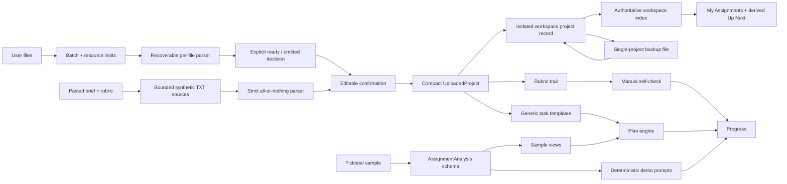

# RubricTrail technical architecture

RubricTrail is a local-first Next.js application with two deliberately separate
paths: a conservative user-source path and a rich fictional sample path.



## Runtime layers

| Layer | Responsibility | Main files |
| --- | --- | --- |
| Workspace activation | First migration, Dashboard, assignment selection, lifecycle/recovery surfaces | `src/components/multi-assignment-workspace/workspace-activation-root.tsx`, `src/components/multi-assignment-workspace/` |
| Assignment shell | Project type, five-stage navigation, real step states, notices | `src/components/rubrictrail-app.tsx`, `workspace-shell.tsx` |
| Source intake | Browser-local TXT, DOCX and text-PDF parsing, lazy local image OCR, plus bounded pasted plain text | `src/lib/files/parse-assignment-files.ts`, `src/lib/files/local-image-ocr.ts`, `src/lib/pasted-text-intake.ts` |
| Confirmation | Editable criteria, an explicit complete/not-complete choice and a 100% gate only for complete weighting | `src/components/upload-summary-view.tsx` |
| Uploaded project | Compact persisted model and generic task templates | `src/lib/uploaded-project.ts` |
| Planning | Deterministic dependency and capacity scheduling | `src/lib/plan.ts` |
| Project Tracker | Transient project-level summary, Calendar drawer and task-list handoff; not a WorkspaceView or persisted state | `src/components/project-tracker.tsx`, `src/lib/project-tracker.ts` |
| Calendar presentation | Canonical transient month/agenda view of Action Plan dates | `src/components/views/plan-calendar-view.tsx`, `src/lib/date-only.ts` |
| ICS export | Browser-local all-day snapshot of remaining tasks | `src/lib/icalendar.ts` |
| Manual locator editing | Post-creation Add/Edit/Remove for criteria without retained evidence | `src/components/uploaded-evidence-panel.tsx` |
| Uploaded checks | Human evidence-trail checklist, no automatic score | `uploaded-project-views.tsx` |
| Sample contract | Strict source, evidence, rubric and feedback schemas | `src/lib/domain.ts`, `src/lib/sample-data.ts` |
| Workspace persistence | Authoritative index, isolated project records, journal/reserve recovery, generation tombstones, migration, coordinator and lifecycle operations | `src/lib/workspace-storage/` |
| Legacy persistence boundary | v0.7.x record/state validation retained for migration and older-tab drift evidence | `src/lib/local-state.ts` |
| Data portability | Unchanged single-project UTF-8 JSON export/import; restore as new or replace selected | `src/lib/project-backup.ts` |
| Optional Live boundary | Authenticated, bounded, disabled-by-default routes | `src/lib/ai/*`, `src/app/api/live/*` |
| Static demo boundary | Separate browser-only export that reuses the product UI without compiling Node-only routes | `demo/`, `scripts/audit-static-demo.mjs` |
| Interface locale | Client-side English/Simplified Chinese dictionaries with an independent versioned preference | `src/lib/i18n/`, `src/components/locale-provider.tsx` |

## Static demo boundary

`pnpm build:demo` builds the separate `demo/app` entry point with Next.js static
export. CI sets `PAGES_BASE_PATH=/rubrictrail`, audits every exported text asset
and serves the generated files at that subpath for the full browser-local suite.
The static artifact contains no Live API path, OpenAI endpoint or Live
credential/configuration marker. The exact-main artifact is published at
<https://sion612.github.io/rubrictrail/> only after its complete CI run passes.

This split is deliberate. The normal application keeps its optional POST Live
routes and Node response-header configuration; neither is representable in the
static artifact. GitHub Pages controls the public demo's HTTPS, caching and
response headers and receives ordinary requests for HTML, JavaScript, CSS and
other assets. Deployment success and a live HTTP smoke check are recorded
separately from the browser suite that runs against the generated artifact in CI.

Workspace persistence remains browser `localStorage`. Storage isolation follows
the page origin, not the `/rubrictrail` path, so unrelated scripts hosted on the
same origin would share that boundary. Project backups remain validated,
single-project portable JSON, not encrypted or signed archives; v0.8.0 does not
define a whole-workspace backup format.

The interface locale is deliberately outside the project protocol. The
`rubrictrail.preferences.v1` value stores only `en` or `zh-CN`, is not included
in project backups, does not participate in project Web Locks or revisions and
is not removed by a project reset. An inline bootstrap selects the saved locale
or a supported browser preference before hydration; the React provider then
updates product copy, `html[lang]`, dates, numbers and client metadata without
keying or remounting the application. User-provided project and source data is
never passed through the translation dictionaries.

The My Assignments Dashboard is workspace navigation, not another assignment
workflow stage. Its cards and Up Next list derive title, deadline, progress and
Action Plan targets from validated project records in memory; those summaries
are not duplicated in the authoritative index. The selected assignment is
current-tab UI state plus a best-effort preference, so switching does not revise
the index or a project.

The Project Tracker is deliberately outside the workflow state. WorkspaceView
remains `overview`, `rubric`, `plan`, `draft` and `progress`; opening the
Tracker, its visible month, selected date and temporary task-focus request are
React UI state only. The Tracker derives its summary and Calendar events from
the one Action Plan already used by Plan and Progress, so completing a task or
rebalancing cannot create a second schedule. Calendar continues to use only
real task target dates and the assignment deadline; it does not create events
for criteria, evidence or workflow stages.

## Trust boundary for user sources

Parsing and extraction do not turn an arbitrary upload or paste into a trusted analysis.
The parser reports only conservative fields and explicit rubric lines. The user
must confirm or edit every planning input, including whether the authoritative
rubric provides a complete percentage breakdown. A parser `null` means that no
weight was confidently extracted; it does not prove that the institution did
not publish one. The persisted `weightingStatus` makes the user's decision
explicit: `complete` requires a positive numeric weight for every criterion and
a 100% total; `incomplete` retains one or more official numbers while allowing
other values to remain `null`; and `none` requires every value to be `null`.
Missing values are never completed or equalized automatically.

Real file selections and pasted text intentionally use different failure
contracts. A real selection is rejected before reading when it exceeds 10 files,
10 MiB per file or 25 MiB in total; the selection-wide limits include files that
might later be omitted. Each PDF is limited to 200 pages, with 400 PDF pages
allowed across the complete selection. Merged extracted text is limited to
2,000,000 normalized characters, 50,000 merged lines and 100,000 merged
whitespace-delimited words. Once page-count metadata is available, that PDF's
pages are charged to the 400-page selection total even if the file is later
offered as an explicit per-file omission for exceeding 200 pages.

Unsupported types, unsafe names, per-file oversize, empty/scanned/encrypted or
damaged documents, and a PDF above its 200-page file limit can be listed as
per-file omissions only when at least one source succeeds. The user must
explicitly accept that readable subset before confirmation. The 400-page
selection limit, any merged-text budget, parser unavailability and unknown
failures stop the complete batch instead; RubricTrail does not use file order to
silently discard later sources. Pasted synthetic TXT sources remain strict and
must all succeed.

PNG, JPEG and WebP inputs are checked against their declared type and magic
bytes, decoded to obtain dimensions, and rejected above 16,384 pixels per side
or 20,000,000 decoded pixels before recognition. The parser lazily imports a
single Tesseract.js worker for the image portion of one batch, recognizes files
sequentially with `eng+chi_sim`, and terminates the worker in a `finally` path.
Pinned worker, LSTM core and trained-data assets are copied by
`scripts/prepare-ocr-assets.mjs` into a same-origin `/ocr/` build directory;
`workerBlobURL: false` and `cacheMethod: none` avoid CDN fallback, blob-worker
lifetime ambiguity and persistent language-data storage. Recoverable image
decode/OCR failures enter the existing explicit partial-batch decision, while
the existing combined character, line and word budgets remain fatal.

TXT decoding is strict UTF-8. A malformed byte sequence is a recoverable
per-file error, never replacement-decoded content. Persisted evidence must carry
both a canonical source id and a filename present in the compact project source
list. A source id cannot map to different filenames, and excerpt offsets must
span exactly the retained excerpt. Direct-string summaries have no authoritative
source object, so their evidence is discarded before project persistence.

The persisted uploaded project includes:

- confirmed title, course label, deadline, word count and citation style;
- source-label or filename list and aggregate extracted word count;
- criterion names, `weightingStatus`, per-criterion published percentages or
  `null`, and short retained source excerpts with recorded source labels and an
  optional `ocr` origin marker;
- task completion, self-check text and checklist state.

It excludes original files and full uploaded or pasted source text. Pasted
intake is bounded before parsing at 100,000 UTF-16 characters and 10,000 lines,
then converted to one or two in-memory plain-text sources so the existing file,
merged-text and evidence-offset boundaries still apply. A future need for larger
local documents should use IndexedDB rather than expanding localStorage. The
internal direct-string summary overload also applies a 2,000,000-character raw
guard before normalization, then applies the normalized merged-text limits; the
normal file and pasted-text paths retain the intake contracts described above.
Omitted file names and issue metadata are transient intake state: they are shown
before and during confirmation, but they are not copied into `UploadedProject`,
localStorage or the backup protocol. Successful source IDs retain their original
selection positions, so skipping a middle file cannot silently renumber later
evidence.
The shared canonical validator accepts only `source-1` through `source-10`;
it does not require contiguous IDs, so partial recovery can still retain
`source-10` when earlier files were omitted.

## Backup and restore boundary

Project backup files use an outer `rubrictrail-project` protocol version and keep
the inner persisted-state version separate. Import checks byte and character
limits, strict UTF-8, JSON shape, both versions and the same deep project schema
used by localStorage. Collection counts are shallow-checked before deep Zod
validation to bound work on untrusted files.

Current exports contain state v3. Valid state-v2 browser data and backup payloads
are migrated through the same validator to state v3; because v2 allowed only a
complete numeric 100% rubric, migrated custom projects receive
`weightingStatus: "complete"`. State v3 retains its existing numeric
`targetGrade` field solely as a backward-compatible encoding for the selected
planning depth. The application converts that legacy value at the persistence
boundary; it is not a target mark, grade estimate or prediction. The four
values exposed by v0.3.4 preserve their task gates and effort multipliers, so
the state-v3 operational contract remains stable while the UI label is fixed.
The original `proofline.project.v1` sample-state migration is also retained.
Unsupported newer state versions are rejected explicitly rather than coerced.

Restore validates and previews the backup, then requires either **restore as
new** or **replace selected**. Restore-as-new assigns a collision-checked project
ID and journals project creation before publishing index membership.
Replace-selected captures the exact project ID, index/record baseline, and
post-confirmation intent before replacing only that record at its next
revision. Neither path lets a backup choose workspace identity, generation,
record revision, or project ID. Detected read, validation, lock, quota,
write/readback, or other-tab failures preserve current authority. Backups are
portable local files, not encrypted archives or automatic synchronization.

Deterministic sample Draft Check output is derived rather than authoritative, so
it is omitted on export and stripped from imported files. The user's draft text
is retained and the check can be rerun locally after restore. Uploaded-project
self-check text is user-authored state and remains portable.

## Multi-tab data integrity

The accepted protocol is specified in
[ADR-0080](./adr/0080-multi-assignment-workspace.md). The authoritative
`rubrictrail.workspace.index.v1` stores workspace identity, generation,
revision, active/tombstone membership, and exact legacy fingerprints. It does
not duplicate title, progress, deadline, course, next target, or other mutable
Dashboard data. Every listed assignment has one strict envelope at:

```text
rubrictrail.workspace.<workspaceId>.generation.<generation>.project.<projectId>.v1
```

A normal content edit rechecks the exact index and affected record after taking
the exclusive `rubrictrail.project.store.v1` Web Lock, then writes and verifies
only that project's next revision. Two same-project edits from one baseline
therefore produce one success and one explicit conflict. Different-project
writes still serialize through the conservative global lock but do not conflict
merely because the other project changed. Switching assignments changes only
current-tab state and the non-authoritative
`rubrictrail.workspace.preferences.v1` value.

Membership and destructive operations span keys, so
`rubrictrail.workspace.operation.v1` records canonical target index bytes and
exact expected/target SHA-256 digests before the first domain mutation. Recovery
classifies real stored bytes rather than trusting the journal phase. A third
value, malformed owned record, or ambiguous namespace scan blocks authority;
even one coherent scan group requires explicit user selection. Web Locks
serialize participating code but do **not** make these `localStorage` writes a
transaction.

The content-free `rubrictrail.workspace.reserve.v1` is exactly 262,144 UTF-16
code units and is maintained to improve the chance that bounded recovery
metadata can be written. It is not guaranteed quota. Product policy recommends
rotation at 64 tombstones, warns at 80 total records, blocks growth at 96, and
rejects a 101st record beyond the 100-record per-generation hard limit. A quota
or reserve failure does not authorize eviction, truncation, or deletion of
another assignment.

First migration reads the exact v0.7.x authoritative and compatibility values,
writes/verifies the journal and new project, then commits the one-assignment
index. Legacy values remain unchanged afterward and their exact fingerprints
are checked on every mutation. A still-open v0.7.x tab can write those keys;
v0.8.0 cannot prevent that old code, so drift pauses mutation and offers an
explicit import-as-new, replace-selected, baseline acceptance, or privacy
cleanup path rather than silently adopting or deleting it.

Delete-project verifies a content-free current-generation tombstone before
publishing tombstone membership; deleting the final assignment leaves a valid
empty active workspace. Explicit whole-workspace privacy deletion alone commits
a new cleared generation, then removes only journaled exact project and legacy
bytes. Generation rotation rewrites and verifies active records into a new
generation before the target index changes authority, preventing a stale
generation from resurrecting deleted content. Unrelated origin storage and the
independent interface-locale preference are never cleanup targets.

If Web Locks are missing or acquisition rejects, authoritative mutation fails
closed: validated assignments remain readable/exportable, new edits remain
only in the current tab, and the product recommends a downloaded backup. The
250 ms autosave debounce plus `visibilitychange` and `pagehide` flush attempts
remain best effort; abrupt shutdown can still lose the last uncommitted edit.
RubricTrail does not automatically merge tab conflicts.

## Plan generation

`buildUploadedPlanTemplates()` creates a generic acyclic graph:

1. confirm the brief;
2. create one evidence task per rubric criterion;
3. build a rubric-led outline;
4. draft with source markers;
5. audit each criterion;
6. complete submission QA.

Only `weightingStatus: "complete"` lets published percentages influence the
starting time and priority of criterion tasks. Both `incomplete` and `none` use
the same neutral time baseline for every criterion, even when an incomplete
rubric retains some known percentages. That equal planning share exists only
inside the generated schedule: it is never persisted as a synthetic rubric
weight, displayed as a percentage or described as equal marks.

The plan engine schedules that graph from a stable planning baseline, the
deadline, weekly capacity and selected planning depth. The fictional sample
uses its fixed sample baseline. An uploaded project validates its already
supported offset-bearing creation timestamp and normalizes that creation
instant to a stable UTC calendar date; the original browser timezone was never
persisted. This derived baseline is not written back to persistence. Empty
state may use the current date only until a project is created.

The browser-local current date is a separate transient presentation input. It
drives **Today** and incomplete-task overdue status in Calendar, Project
Tracker, Dashboard and **Up Next**, refreshing across local midnight and when
the page regains focus or visibility. It does not regenerate or slide existing
task target dates. Planning depth can include additional review tasks and
changes the time allowance applied to the schedule; it does not correspond to
a grading band or predict an outcome. UI checkboxes and the state update
handler both block completion when dependencies are unfinished.

## Honest workflow state

Step state is derived from data, never navigation position:

- Brief and Rubric become confirmed when the project is created;
- Plan uses task completion;
- Check uses saved sample output or completed uploaded self-checks;
- Progress uses plan, self-check and human checklist state.

The uploaded Check view records whether a user can point to visible evidence,
an explained link and a traceable source. It does not validate those answers or
predict a grade.

## Sample and optional Live contracts

The fictional sample uses strict `AssignmentAnalysis` and `DraftCheckResult`
schemas. Validation enforces source excerpt membership, known evidence and rubric
IDs, exact draft spans, 100% rubric weights and internally consistent weighted
coverage.

The optional Live adapter shares those contracts but is not exposed in the UI.
See [LIVE_AI_ARCHITECTURE.md](./LIVE_AI_ARCHITECTURE.md).

## Performance and accessibility choices

- PDF.js, Mammoth and Tesseract.js are dynamically imported only for their file
  types. OCR worker/core/language assets are absent from initial HTML and served
  from the application origin only when an image is selected.
- File-count, byte, image-dimension, PDF-page and merged-text limits bound accepted work and
  retained parser output, but they are not a CPU or peak-memory sandbox. PDF
  metadata is loaded before page-count checks, one page's text items can be
  materialized before its text is counted, image decode/OCR allocates memory and
  CPU before recognized text can be counted, and DOCX decompression occurs before
  extracted-text limits can be applied. Parsing is currently not cancellable;
  do not open deliberately malicious documents.
- Plan generation and template creation are memoized by their real inputs.
- No login, analytics, database or remote bootstrap runs in local mode.
- Local-first does not imply complete offline startup: the current page performs
  its project work in the browser, but no service worker guarantees that the app
  shell can be loaded or reopened without its host.
- Evidence drawers trap focus, close with Escape and restore focus.
- Workflow states have visible text, not color alone.
- Motion respects `prefers-reduced-motion`.
- Desktop and mobile tests assert no document-level horizontal overflow.
